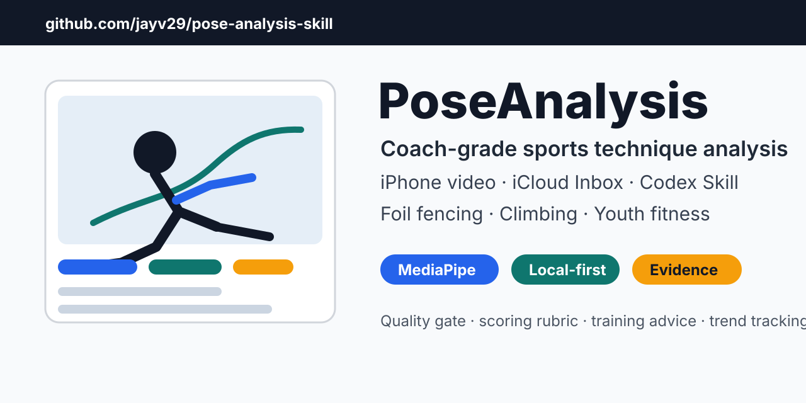
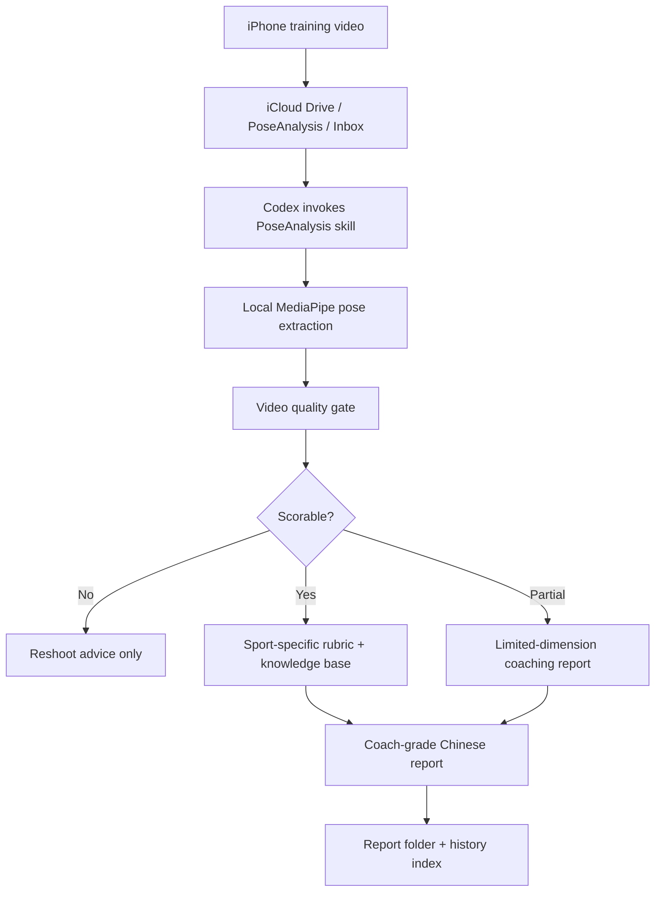

# PoseAnalysis

**Coach-grade sports technique analysis from iPhone training videos, built as a Codex skill.**

[中文说明](README.zh-CN.md) · [Release v3.0.0](https://github.com/jayv29/pose-analysis-skill/releases/tag/v3.0.0)




PoseAnalysis turns local training videos into professional Chinese coaching reports. It is designed for a parent-coach workflow: record a child athlete on an iPhone, save the video to iCloud Drive, let Codex run local pose extraction, then produce an evidence-based report with technical scoring, training advice, next-session tracking metrics, and same-template history comparison.

This is not a SaaS product and not a generic pose demo. It is a Codex skill with a bundled sports knowledge base, deterministic local scripts, and strict report rules.

## Why It Exists

Most training videos are watched once and forgotten. PoseAnalysis makes them useful:

- **Before analysis:** decide whether the video is actually scorable.
- **During analysis:** extract body-angle and pose-quality evidence locally.
- **After analysis:** generate a coach-facing report that says what improved, what regressed, what to train next, and what to track next time.

## Highlights

- **iPhone-first workflow**: save videos to iCloud Drive `PoseAnalysis/Inbox`.
- **Local pose extraction**: MediaPipe runs on the Mac; no video upload is required by the scripts.
- **Video quality gate**: every report starts with `Scorable`, `Partially scorable`, or `Not scorable`.
- **Coach-grade Chinese reports**: final output is written for coaches first, parents second, and child-safe by default.
- **Three sport domains**: foil fencing, top-rope/lead climbing, and youth fitness.
- **Professional knowledge base**: scoring rubrics, phase recognition, evidence standards, history comparison rules, and privacy guardrails.
- **Evidence-backed references**: official federation rules, MediaPipe/BlazePose research, youth training guidance, and pose-estimation limitations are tracked explicitly.
- **History-aware**: compares only the same athlete, sport, action template, phase, and comparable capture quality.
- **Privacy-first**: child identity is anonymized by default.

## Professional Reference Base

The analysis layer is intentionally source-aware. The bundled rubrics are shaped by official sport rules, sport-science references, and computer-vision limits instead of generic coaching language. These sources are references, not official endorsement.

| Area | Reference sources | Used for |
| --- | --- | --- |
| Pose extraction | [Google MediaPipe Pose Landmarker](https://ai.google.dev/edge/mediapipe/solutions/vision/pose_landmarker), [BlazePose paper](https://arxiv.org/abs/2006.10204) | 33-landmark body model, video-frame processing, confidence thresholds, on-device pose-estimation assumptions |
| Single-camera limits | [Human movement pose-estimation review](https://doi.org/10.1016/j.heliyon.2024.e39977) | occlusion risk, confidence labels, posture-analysis limitations, conservative report language |
| Foil fencing | [FIE Rules](https://fie.org/fie/documents/rules), [FIE Technical Rules](https://static.fie.org/uploads/38/190673-technical%20rules%20ang.pdf) | foil terminology, offensive-action context, piste and equipment boundaries |
| Climbing | [World Climbing Competition Resources](https://www.worldclimbing.com/resources/competitions), [Competition Rules](https://images.ifsc-climbing.org/ifsc/image/private/t_q_good/prd/jaq7awz9jmqwpddwnbpr.pdf) | lead/top-rope domain language, route context, clipping and competition terminology |
| Youth fitness | [NSCA youth resistance training position statement](https://doi.org/10.1519/JSC.0b013e31819df407), [WHO physical activity guidelines](https://www.who.int/publications/b/55518) | age-appropriate load, supervision, technique-first progressions, health-boundary language |

Full source notes live in [`docs/references/professional-sources.md`](docs/references/professional-sources.md).

## Supported Analysis Templates

| Sport | First-class templates | Focus |
| --- | --- | --- |
| Foil fencing | Lunge sprint drill, 1:1 lesson clip, bout clip, weighted lunge variation | footwork, lunge depth, front-knee control, trunk stability, recovery |
| Climbing | Top-rope continuous climb, lead continuous climb, crux move, footwork and center-of-mass control | foot accuracy, hip movement, arm economy, route rhythm, clipping position |
| Youth fitness | Squat, split squat/lunge, push-up, plank/hollow hold, jump landing, single-leg control | movement quality, joint path, trunk/pelvis control, symmetry, consistency |

## How It Works



## Demo Reports And Showcase

- Project page: [`docs/index.html`](docs/index.html)
- Anonymous examples: [`examples/reports`](examples/reports)
- Social preview asset: [`docs/assets/social-preview.svg`](docs/assets/social-preview.svg)

The demo reports are synthetic and anonymized. They are meant to show report structure, evidence labeling, and next-session metrics without exposing real child videos.

## Quick Start

### 1. Clone

```bash
git clone https://github.com/jayv29/pose-analysis-skill.git
cd pose-analysis-skill
```

### 2. Install the Codex skill locally

```bash
mkdir -p ~/.codex/skills
cp -R pose-analysis ~/.codex/skills/pose-analysis
```

### 3. Create the iCloud folders

```bash
mkdir -p "$HOME/Library/Mobile Documents/com~apple~CloudDocs/PoseAnalysis/Inbox"
mkdir -p "$HOME/Library/Mobile Documents/com~apple~CloudDocs/PoseAnalysis/Report/_artifacts"
```

### 4. Install Python dependencies

```bash
python3 -m venv ~/.venv-pose
~/.venv-pose/bin/pip install -r pose-analysis/requirements.txt
```

### 5. Download the MediaPipe pose model

```bash
bash pose-analysis/scripts/download_pose_model.sh
```

## Usage

Analyze the newest video in the iCloud Inbox:

```bash
bash ~/.codex/skills/pose-analysis/scripts/run_skill.sh --latest
```

Analyze a specific video with explicit sport context:

```bash
POSE_ANALYSIS_SPORT=花剑 \
POSE_ANALYSIS_TEMPLATE=弓步冲刺专项 \
bash ~/.codex/skills/pose-analysis/scripts/run_skill.sh "/path/to/video.mov"
```

Recommended filename format:

```text
YYYY-MM-DD_项目_动作模板_A01.mov
```

Examples:

```text
2026-05-25_花剑_弓步冲刺专项_A01.mov
2026-05-25_攀岩_lead_连续上攀_A01.mov
2026-05-25_体能_深蹲_A01.mov
```

## Generated Outputs

The runner writes to:

```text
~/Library/Mobile Documents/com~apple~CloudDocs/PoseAnalysis/Report
```

Typical files:

- `*.pose.YYYYMMDD.json`: pose metrics, quality metadata, sampled frames, and key frames.
- `*.md`: machine-generated report skeleton for Codex to complete.
- `history_index.json`: same-template history index.
- `*_专业分析报告_YYYYMMDD.md`: final coach-grade report produced by Codex.

For a cleaner report folder, intermediate skeletons and raw artifacts can be collected under:

```text
~/Library/Mobile Documents/com~apple~CloudDocs/PoseAnalysis/Report/_artifacts
```

## Knowledge Base

PoseAnalysis ships with a structured reference system:

- [`professional-analysis-standard.md`](pose-analysis/references/knowledge-base/professional-analysis-standard.md): evidence levels, confidence rules, and single-camera limits.
- [`phase-recognition.md`](pose-analysis/references/phase-recognition.md): action-phase recognition for all supported templates.
- [`foil-advanced.md`](pose-analysis/references/knowledge-base/foil-advanced.md): foil scoring, fault taxonomy, training prescriptions, and history metrics.
- [`climbing-advanced.md`](pose-analysis/references/knowledge-base/climbing-advanced.md): climbing scoring for top-rope, lead, crux, footwork, and center-of-mass control.
- [`fitness-advanced.md`](pose-analysis/references/knowledge-base/fitness-advanced.md): youth fitness rubrics and red/yellow/green movement-quality grading.
- [`final-report-quality.md`](pose-analysis/references/final-report-quality.md): final report acceptance checklist.

## Report Philosophy

PoseAnalysis is strict about evidence:

- If the video is not good enough, it says **not scorable**.
- If a dimension is hidden or unreliable, it says **insufficient evidence**.
- If a conclusion is scored, it must cite video timing, pose metrics, or visible action phases.
- If a child is being evaluated, the report uses professional but non-shaming language.

## Project Structure

```text
pose-analysis-skill/
├── pose-analysis/
│   ├── SKILL.md
│   ├── agents/openai.yaml
│   ├── requirements.txt
│   ├── scripts/
│   │   ├── pose_analyzer.py
│   │   ├── report_formatter.py
│   │   ├── run_skill.sh
│   │   └── download_pose_model.sh
│   └── references/
│       ├── video-quality-gate.md
│       ├── report-templates.md
│       ├── phase-recognition.md
│       └── knowledge-base/
├── docs/
│   ├── product/
│   ├── references/
│   └── skill-design/
├── examples/
│   └── reports/
├── .github/
│   └── ISSUE_TEMPLATE/
├── tests/
├── README.md
├── README.zh-CN.md
├── CHANGELOG.md
├── CONTRIBUTING.md
├── SECURITY.md
├── LICENSE
└── VERSION
```

## Development

Run tests:

```bash
PYTHONDONTWRITEBYTECODE=1 python3 -m unittest discover -s tests
```

Compile scripts:

```bash
PYTHONPYCACHEPREFIX=/tmp/pose-analysis-pycache python3 -m py_compile \
  pose-analysis/scripts/pose_analyzer.py \
  pose-analysis/scripts/report_formatter.py \
  pose-analysis/scripts/analyze_pose.py
```

Check shell scripts:

```bash
bash -n pose-analysis/scripts/run_skill.sh
bash -n pose-analysis/scripts/download_pose_model.sh
```

Validate the Codex skill:

```bash
python3 ~/.codex/skills/.system/skill-creator/scripts/quick_validate.py pose-analysis
```

## Roadmap

- Move machine-generated skeletons and raw pose JSON into `_artifacts` automatically.
- Add richer final-report writing automation while keeping Codex as the reasoning layer.
- Add more sport-specific phase detectors.
- Improve multi-video history comparison and trend summaries.
- Add example anonymized reports and capture-angle guides.

## Privacy And Safety

- Videos remain local unless the user explicitly uploads or shares them.
- Child identity is anonymized by default.
- Reports are not medical diagnoses.
- The system avoids claims that cannot be supported by single-camera video.

## License

[MIT](LICENSE).
