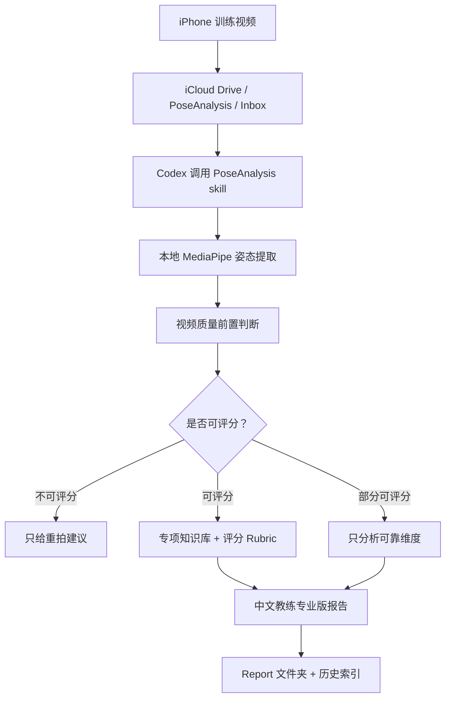

# PoseAnalysis

**基于 iPhone 训练视频的教练级运动技术分析 Codex Skill。**

[English](README.md) · [Release v3.0.0](https://github.com/jayv29/pose-analysis-skill/releases/tag/v3.0.0)


PoseAnalysis 可以把本地训练视频转化为中文教练专业版技术报告。典型流程是：用 iPhone 拍摄孩子训练视频，保存到 iCloud Drive，Codex 调用本地 MediaPipe 提取姿态数据，再结合内置运动知识库生成报告，包括技术评分、关键问题、训练建议、下次追踪指标和同模板历史对比。

它不是 SaaS，也不是通用姿态识别 Demo。它是一个 Codex Skill：用本地脚本做确定性姿态提取，用结构化知识库约束专业分析，用 Codex 当前会话完成最终教练报告。

## 为什么需要它

大多数训练视频看完一次就被遗忘。PoseAnalysis 的目标是让训练视频变成可复盘、可追踪、可执行的训练资料：

- **分析前**：先判断视频是否真的适合评分。
- **分析中**：本地提取姿态、角度、关键帧和视频质量证据。
- **分析后**：输出教练能复核、家长能理解、孩子看了不会被羞辱的训练报告。

## 核心卖点

- **iPhone 优先工作流**：视频保存到 iCloud Drive `PoseAnalysis/Inbox` 即可。
- **本地姿态提取**：MediaPipe 在 Mac 本机运行，脚本默认不上传视频。
- **视频质量前置门槛**：每次分析先判断 `可评分 / 部分可评分 / 不可评分`。
- **中文教练专业版报告**：以教练为主读者，家长可理解，儿童隐私脱敏。
- **三大运动方向**：花剑、top-rope/lead 攀岩、儿童基础体能。
- **专业知识库**：内置评分 rubric、动作阶段识别、证据等级、历史对比和隐私规则。
- **历史追踪**：只比较同一运动员、同一项目、同一动作模板、同一阶段和可比拍摄质量。
- **隐私优先**：默认使用匿名身份，不记录儿童真实姓名。

## 支持的分析模板

| 项目 | 第一版重点模板 | 分析重点 |
| --- | --- | --- |
| 花剑 | 弓步冲刺专项、一对一教练课、实战比赛、负重弓步变式 | 步法、弓步深度、前膝控制、躯干稳定、回收 |
| 攀岩 | top-rope 连续上攀、lead 连续上攀、单个难点、脚法与重心控制 | 脚点准确性、髋部移动、手臂效率、路线节奏、clip 站位 |
| 基础体能 | 深蹲、弓步/分腿蹲、俯卧撑、平板/hollow、跳跃落地、单腿控制 | 动作质量、关节轨迹、躯干骨盆控制、左右对称、重复一致性 |

## 工作流



## 快速开始

### 1. 克隆仓库

```bash
git clone https://github.com/jayv29/pose-analysis-skill.git
cd pose-analysis-skill
```

### 2. 安装为本地 Codex Skill

```bash
mkdir -p ~/.codex/skills
cp -R pose-analysis ~/.codex/skills/pose-analysis
```

### 3. 创建 iCloud 文件夹

```bash
mkdir -p "$HOME/Library/Mobile Documents/com~apple~CloudDocs/PoseAnalysis/Inbox"
mkdir -p "$HOME/Library/Mobile Documents/com~apple~CloudDocs/PoseAnalysis/Report/_artifacts"
```

### 4. 安装 Python 依赖

```bash
python3 -m venv ~/.venv-pose
~/.venv-pose/bin/pip install -r pose-analysis/requirements.txt
```

### 5. 下载 MediaPipe 姿态模型

```bash
bash pose-analysis/scripts/download_pose_model.sh
```

## 使用方式

分析 iCloud Inbox 里最新视频：

```bash
bash ~/.codex/skills/pose-analysis/scripts/run_skill.sh --latest
```

指定视频并明确项目：

```bash
POSE_ANALYSIS_SPORT=花剑 \
POSE_ANALYSIS_TEMPLATE=弓步冲刺专项 \
bash ~/.codex/skills/pose-analysis/scripts/run_skill.sh "/path/to/video.mov"
```

推荐文件名：

```text
YYYY-MM-DD_项目_动作模板_A01.mov
```

示例：

```text
2026-05-25_花剑_弓步冲刺专项_A01.mov
2026-05-25_攀岩_lead_连续上攀_A01.mov
2026-05-25_体能_深蹲_A01.mov
```

## 输出文件

默认输出目录：

```text
~/Library/Mobile Documents/com~apple~CloudDocs/PoseAnalysis/Report
```

常见文件：

- `*.pose.YYYYMMDD.json`：姿态指标、质量元数据、采样帧、关键帧。
- `*.md`：脚本生成的报告骨架，供 Codex 补全最终报告。
- `history_index.json`：同模板历史索引。
- `*_专业分析报告_YYYYMMDD.md`：Codex 生成的最终教练专业版报告。

建议把中间产物收拢到：

```text
~/Library/Mobile Documents/com~apple~CloudDocs/PoseAnalysis/Report/_artifacts
```

## 专业知识库

PoseAnalysis 内置结构化运动分析资料：

- [`professional-analysis-standard.md`](pose-analysis/references/knowledge-base/professional-analysis-standard.md)：证据等级、置信度、单机位视频边界。
- [`phase-recognition.md`](pose-analysis/references/phase-recognition.md)：三项目动作阶段识别。
- [`foil-advanced.md`](pose-analysis/references/knowledge-base/foil-advanced.md)：花剑高级评分、错误分型、训练处方和历史指标。
- [`climbing-advanced.md`](pose-analysis/references/knowledge-base/climbing-advanced.md)：攀岩 top-rope、lead、难点、脚法和重心控制 rubric。
- [`fitness-advanced.md`](pose-analysis/references/knowledge-base/fitness-advanced.md)：儿童基础体能评分和红黄绿动作质量分级。
- [`final-report-quality.md`](pose-analysis/references/final-report-quality.md)：最终报告质量检查标准。

## 报告原则

PoseAnalysis 对证据要求很严格：

- 视频不适合分析，就输出 **不可评分**。
- 某个维度看不清，就写 **证据不足**。
- 评分必须引用时间点、姿态指标或可见动作阶段。
- 儿童报告使用专业但不羞辱的语言。

## 项目结构

```text
pose-analysis-skill/
├── pose-analysis/
│   ├── SKILL.md
│   ├── agents/openai.yaml
│   ├── requirements.txt
│   ├── scripts/
│   │   ├── pose_analyzer.py
│   │   ├── report_formatter.py
│   │   ├── run_skill.sh
│   │   └── download_pose_model.sh
│   └── references/
│       ├── video-quality-gate.md
│       ├── report-templates.md
│       ├── phase-recognition.md
│       └── knowledge-base/
├── docs/
│   ├── product/
│   └── skill-design/
├── tests/
├── README.md
├── README.zh-CN.md
├── CHANGELOG.md
└── VERSION
```

## 开发与验证

运行测试：

```bash
PYTHONDONTWRITEBYTECODE=1 python3 -m unittest discover -s tests
```

编译脚本：

```bash
PYTHONPYCACHEPREFIX=/tmp/pose-analysis-pycache python3 -m py_compile \
  pose-analysis/scripts/pose_analyzer.py \
  pose-analysis/scripts/report_formatter.py \
  pose-analysis/scripts/analyze_pose.py
```

检查 shell 脚本：

```bash
bash -n pose-analysis/scripts/run_skill.sh
bash -n pose-analysis/scripts/download_pose_model.sh
```

校验 Codex Skill：

```bash
python3 ~/.codex/skills/.system/skill-creator/scripts/quick_validate.py pose-analysis
```

## 路线图

- 自动把报告骨架和原始 JSON 收拢到 `_artifacts`。
- 在保持 Codex 作为推理层的前提下，增强最终报告生成流程。
- 增加更多动作阶段检测。
- 强化多视频历史趋势分析。
- 增加匿名示例报告和拍摄角度指南。

## 隐私与安全

- 视频默认留在本地。
- 儿童身份默认匿名。
- 报告不是医疗诊断。
- 不输出单机位视频无法支持的结论。

## License

MIT.
