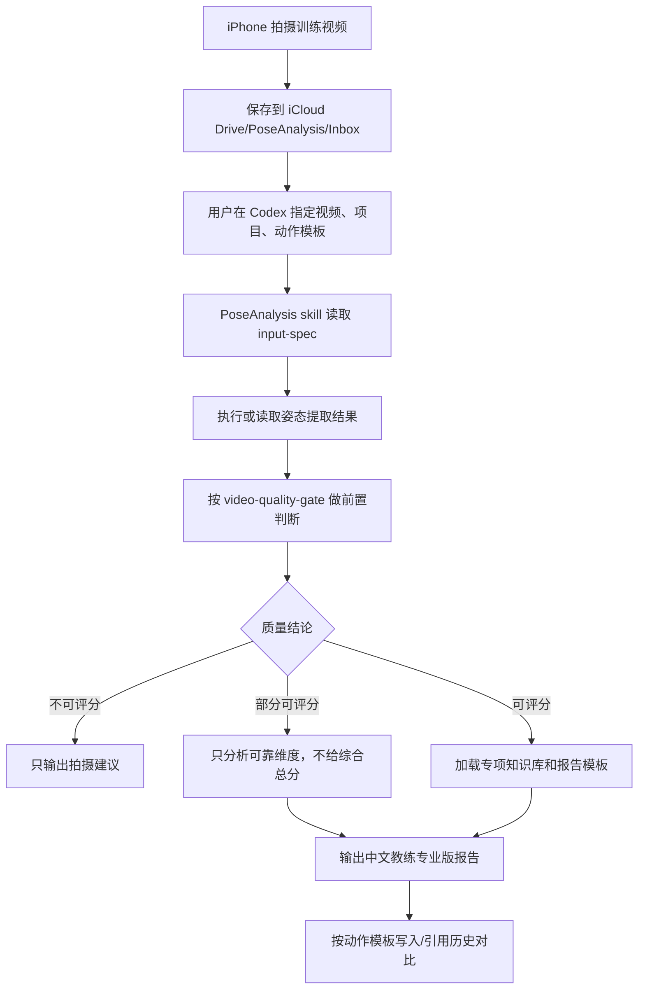

# PoseAnalysis Skill 改造设计

**版本:** 2026-05-24
**范围:** 文档与 skill 规格设计
**代码状态:** 本阶段不修改执行代码

## 1. 背景

当前 PoseAnalysis 已从 OpenClaw skill 迁移为 Codex skill。现有能力偏向通用姿态提取和报告骨架生成，缺少三个关键产品能力：

- 视频质量前置判断
- 花剑、攀岩、基础体能的专项报告模板
- 按动作模板做历史对比

本次改造先建立文档规格，让后续代码变更有稳定目标。

## 2. 设计原则

### 保持 Codex skill 形态

PoseAnalysis 不发展成独立产品。Codex 负责理解用户指令、读取本地文件、调用本地脚本、结合知识库生成报告。

### 让用户指定项目

第一版不做自动项目识别。项目和动作模板由文件名或用户指令提供，降低误判风险。

### 先判定可分析性

视频质量是报告可信度的前提。skill 必须先输出质量结论，再决定是否评分。

### 知识库分层

`SKILL.md` 只保留核心流程和导航。详细规则放入 `references/`，按需要加载，避免每次触发 skill 时加载过多上下文。

## 3. 文件边界

### 项目级文档

- `docs/product/PRODUCT_REQUIREMENTS.md`：产品需求和范围。
- `docs/skill-design/POSE_ANALYSIS_SKILL_REDESIGN.md`：skill 改造设计。

### Skill 入口

- `pose-analysis/SKILL.md`：Codex 触发后的最小运行流程与 reference 导航。

### Skill references

- `pose-analysis/references/input-spec.md`：输入路径、命名、指令规范。
- `pose-analysis/references/video-quality-gate.md`：质量前置分析与不可评分规则。
- `pose-analysis/references/report-templates.md`：三项目报告模板。
- `pose-analysis/references/history-comparison.md`：历史对比规则。
- `pose-analysis/references/privacy.md`：儿童隐私与脱敏规则。
- `pose-analysis/references/knowledge-base/README.md`：知识库使用策略与来源分级。
- `pose-analysis/references/knowledge-base/foil.md`：花剑技术分析知识库。
- `pose-analysis/references/knowledge-base/climbing.md`：攀岩技术分析知识库。
- `pose-analysis/references/knowledge-base/fitness.md`：儿童基础体能知识库。

### 执行脚本

本阶段不修改：

- `pose-analysis/scripts/pose_analyzer.py`
- `pose-analysis/scripts/report_formatter.py`
- `pose-analysis/scripts/analyze_pose.py`
- `pose-analysis/scripts/run_skill.sh`
- `pose-analysis/scripts/download_pose_model.sh`

后续代码阶段再把文档规则固化进脚本或报告生成器。

## 4. 数据流



## 5. 质量门槛设计

质量门槛分为通用门槛和项目专项门槛。

通用门槛判断：

- 画面是否完整包含运动员核心身体部位。
- 视频是否有足够动作周期。
- 是否存在严重遮挡、模糊、过暗、过曝。
- 运动员是否是主要画面主体。
- 拍摄角度是否适合当前动作模板。

项目专项门槛判断：

- 花剑：弓步方向、双脚、髋膝踝、躯干和持剑臂是否可见。
- 攀岩：手脚触点、髋部、肩肘、路线方向和墙面是否可见。
- 体能：动作主要平面是否清楚，是否能看到关键关节和完整动作周期。

## 6. 报告设计

报告共用框架：

1. 本次结论
2. 拍摄质量与置信度
3. 技术评分
4. 关键证据
5. 主要问题
6. 训练建议
7. 下次追踪指标
8. 历史对比
9. 隐私说明

三个项目使用不同的评分维度和证据表达方式，不共用同一套泛化评分表。

## 7. 历史对比设计

历史比较键：

```text
匿名运动员ID + 项目 + 动作模板
```

历史对比不按文件夹中的所有视频混合比较，只比较相同动作模板。

报告优先输出：

- 相对上一次的变化
- 最近三次趋势
- 本次新增问题
- 本次改善最明显的维度
- 下次必须复测的指标

## 8. 知识库设计

知识库按项目拆分，使用四级来源策略：

1. 官方或协会训练/规则/教练资料
2. 同行评审运动科学、运动生物力学研究
3. 受认可教练体系或专业训练机构资料
4. 用户和教练在本项目中的本地经验

报告可以使用模型推理，但必须把结论约束在知识库和视频证据内。没有证据的内容只能写成假设或建议复拍，不能写成确定判断。

## 9. 后续代码改造建议

后续进入代码阶段时，建议按以下顺序：

1. 增加输入解析：从文件名或指令中提取项目和动作模板。
2. 增加质量前置分析：输出 `可评分/部分可评分/不可评分`。
3. 调整报告 formatter：按项目模板生成报告骨架。
4. 增加历史索引：按动作模板保存和读取历史指标。
5. 增加 iCloud Inbox 默认输入辅助：列出最新候选视频。

本阶段只完成文档，不执行上述代码改造。

## 10. 验证标准

文档阶段完成后，应能验证：

- iCloud Drive `PoseAnalysis/Inbox` 已存在。
- `SKILL.md` 明确引用输入规范、质量门槛、报告模板、历史对比和隐私规则。
- `references/knowledge-base/` 下有三项目知识库入口。
- 没有修改执行脚本。
